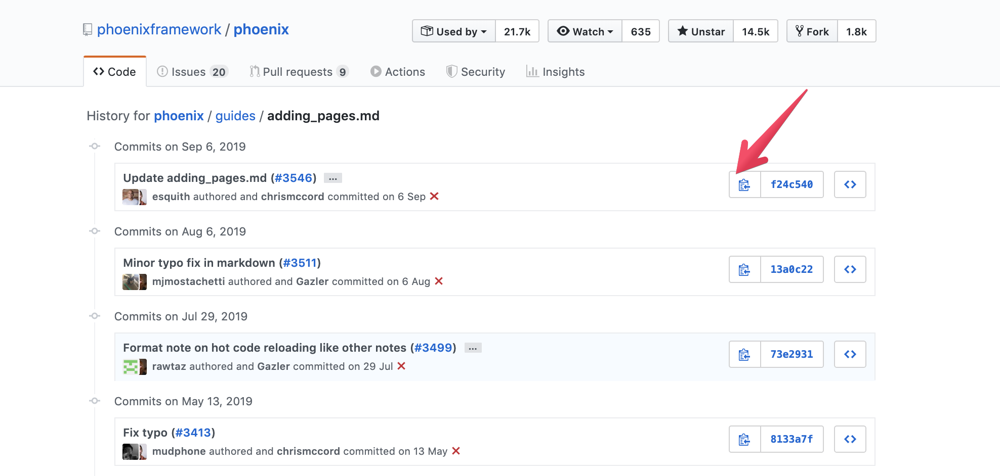

# Contribution Guide

## 翻訳対象

2019年11月時点で、phoenixframework/phoenixリポジトリのguidesディレクトリを翻訳しています。

- リポジトリ: [https://github.com/phoenixframework/phoenix/tree/master/guides](https://github.com/phoenixframework/phoenix/tree/master/guides)
- hexdocs: [https://hexdocs.pm/phoenix](https://hexdocs.pm/phoenix)

## Issues

Issueに未対応のファイルをリスト化しています。対応してくださる方は対応するissueに対してassigneeを設定後、Pull Requestの作成をお願いします。

[https://github.com/fukuoka-ex/phoenix-guide-ja/issues](https://github.com/fukuoka-ex/phoenix-guide-ja/issues)

## mdファイルの書き方
翻訳元リポジトリのファイルのcommit hashをmdファイルに記載してください。


```
---
layout: default
group: guides
title: Ecto
nav_order: 11
hash: f24c540504f07c06c9f1af951b889b5b297c54e0 ← ここを書き換える
---
```

hashの値については、ファイルのHistoryのページからコピーできます。




[GitHub Actionのworkflow](https://github.com/fukuoka-ex/phoenix-guide-ja/blob/master/.github/workflows/check_hash.yml)によってdailyで翻訳元リポジトリのcommit logを確認し、翻訳ファイルのhashと差分が生じている場合は自動でissueが作成されます。


## Pull Request

- 翻訳元サイトの変更の追従
- 翻訳内容の改善
- Jekyllテンプレートの改善
- ディレクトリ構成の改善

など、このリポジトリへの改善全般をPull Requestでいつでも受け付けています。

疑問点や質問はIssueを立てて相談をお願いします。